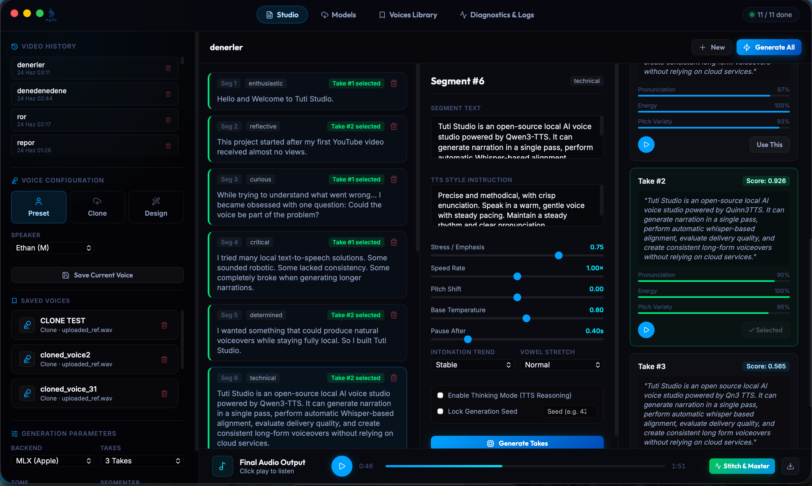
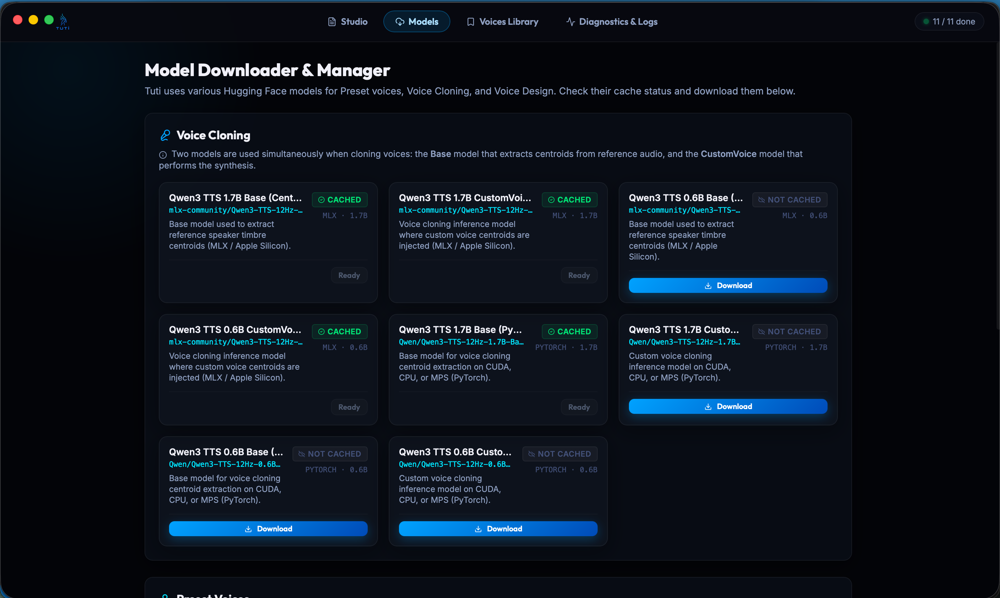
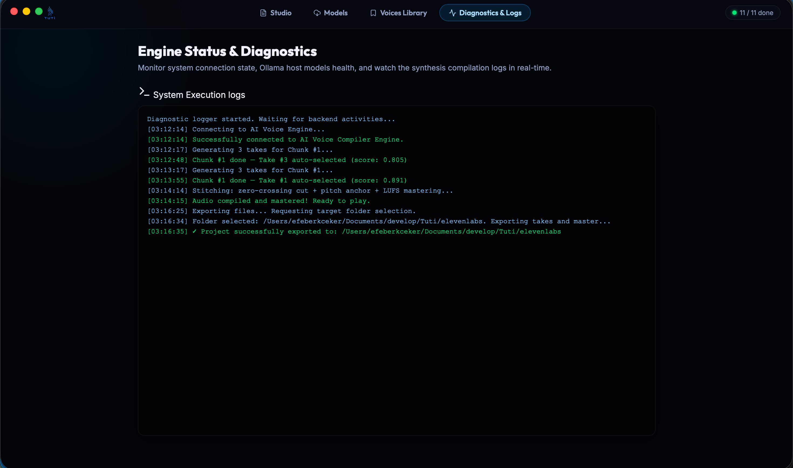

# 🎙 Tuti Studio

<p align="center">
  
</p>

<p align="center">
  <audio src="assets/repo_ses.MP3" controls>
    <a href="assets/repo_ses.MP3">Tanıtım seslendirmesini dinleyin (repo_ses.MP3)</a>
  </audio>
</p>

<p align="center">
  <a href="README.md">🇺🇸 English Documentation</a>
</p>

**Qwen3-TTS tabanlı, açık kaynaklı yerel yapay zeka ses stüdyosu.**

Qwen3-TTS, Whisper hizalaması ve Apple Silicon MLX ivmelendirmesini kullanarak tamamen yerel olarak doğal seslendirmeler üretin.

Bulut servisleri yok.
Abonelikler yok.
API anahtarları yok.

Ses üretim süreçleri üzerinde tam kontrol sahibi olmak isteyen içerik üreticileri için geliştirildi.

---

### 📥 Son Sürümleri İndir (Download Releases)

| Platform | Mimari | Paket Türü | Bağlantı |
| :--- | :--- | :--- | :--- |
| **macOS** (Apple Silicon) | Apple Silicon (M1/M2/M3/M4) | DMG Yükleyici | [Tuti.dmg İndir (macOS)](bin/Tuti.dmg) |
| **Windows** (Intel/AMD) | x64 (AMD64) | Taşınabilir (Portable) Exe | [Tuti-amd64-portable.exe İndir (Windows)](bin/Tuti-amd64-portable.exe) |
| **Windows** (ARM64) | ARM64 | Taşınabilir (Portable) Exe | [Tuti-arm64-portable.exe İndir (Windows)](bin/Tuti-arm64-portable.exe) |

---

## Ekran Görüntüleri

<p align="center">
  
  <br>
  <em>Ses Üretimi & Segment Editörü</em>
</p>

<p align="center">
  
  <br>
  <em>Yerel Model Yönetimi & İndirme Ekranı</em>
</p>

<p align="center">
  
  <br>
  <em>Gerçek Zamanlı Sentez Logları & İşlem Akışı</em>
</p>

---

## Neden Geliştirdim?

Bu proje, ilk YouTube videom neredeyse hiç izlenmedikten sonra başladı.

Neyin yanlış gittiğini anlamaya çalışırken, basit bir soruya takıntılı hale geldim:

> Acaba ses, sorunun bir parçası olabilir miydi?

Birçok yerel metinden sese (TTS) çözümünü denedim.

Bazıları robotik geliyordu.

Bazılarında tutarlılık yoktu.

Bazıları ise uzun seslendirmeler üretirken tamamen çöküyordu.

Tamamen yerel çalışan ve doğal seslendirmeler üretebilecek bir şey istiyordum.

Ben de Tuti Studio'yu geliştirdim.

---

## Tuti Studio'yu Farklı Kılan Ne?

Birçok yapay zeka seslendirme iş akışı şu şekildedir:

1. 3-5 adet take üret
2. Hepsini dinle
3. En iyi kısımları kesip birleştir
4. Audacity'yi aç
5. Zamanlamayı elle düzelt
6. Dışa aktar

Tuti Studio bu süreci otomatikleştirmeyi amaçlar.

Yapabildikleri:

* Birden fazla take üretme
* Whisper zaman damgalarını kullanarak konuşma hizalama
* Seslendirme kalitesini puanlama
* Ritim ve zamanlamayı değerlendirme
* En güçlü performansı otomatik olarak seçme

Amaç basit:

> Bulut servislerine bağımlı kalmadan daha iyi seslendirmeler üretmek.

---

## Önce Tek Geçişte Üretim (Single-Pass First)

Tuti Studio gelişmiş take üretimi ve hizalama iş akışlarını desteklese de, projenin birincil hedeflerinden biri tek bir üretim geçişinde (single-pass) yüksek kaliteli seslendirmeler elde etmektir.

En iyi iş akışı, görünmez olan iş akışıdır.

Metni yaz.
Sesi üret.
Yayınla.

---

## Wails ve Ollama: Apple Silicon İçin Pratik Mimari

Yapay zeka ses üretimi zaten ciddi oranda bellek ve işlemci gücü tüketiyor. Bu yüzden ağır bir arayüzün veya fazladan bir LLM motorunun sistemi yormasını istemedim.

### Neden Electron Yerine Wails?
Sırf butonları ve sürgüleri göstermek için kullanıcı arayüzünün yüzlerce megabayt ek kaynak tüketmesini istemedim. Tuti Studio, hafif bir masaüstü uygulaması sunmak ve tüm sistem kaynaklarını ses üretimine odaklamak için **Wails (Go + HTML/JS)** kullanır.

### Neden Ses Haritası (Speech Map) İçin Ollama?
Tuti Studio, sesi üretmeden önce metni analiz ederek bir **Ses Haritası** (Speech Map / Prosody Plan) oluşturur. Bu harita:
1. Metni, TTS modelinin tekrara düşmesini veya hata yapmasını önlemek için 50 kelimeden kısa en uygun segmentlere böler.
2. Segmentleri prozodik işaretlemelerle (vurgu için BÜYÜK HARF, duraksamalar için `...`) yeniden yazar.
3. Her segment için hız, stres, tonlama ve `tts_instruct` yönergeleri gibi parametreleri dinamik olarak belirler.

Bu haritayı oluşturmak bir dil modeli (LLM) gerektirir. Yerel TTS modelleri ve Whisper zaten diskte ve RAM'de ciddi yer kaplarken, sadece prozodi planlaması için sıfırdan devasa bir LLM çalışma zamanı ve model ağırlıkları indirmek israftı.

MacBook'umun depolama alanı zaten tükenmek üzereydi ve Ollama halihazırda kuruluydu. Sistemdeki yerel Ollama örneğine (örneğin `qwen3:8b` modeline) bir köprü kurarak, ek bir kurulum veya bellek yükü getirmeden bu metin planlama işini akıllıca çözmüş olduk.

Bazen iyi mühendislik, pratik kararlar alabilmek ve zaten orada olan kaynakları kullanabilmekle ilgilidir.

## Derleme ve Paketleme

Tuti Studio, masaüstü uygulama katmanı olarak **Wails v3** kullanmaktadır. Hem macOS hem de Windows için üretim sürümleri (production releases) oluşturmak üzere hazır betikler sunulmuştur.

### Ön Gereksinimler
* **Go** (1.21 veya üzeri)
* **Node.js & npm**
* **Wails v3 CLI** (`go install github.com/wailsapp/wails/v3/cmd/wails3@latest`)
* **Python 3** (ortamınızda MLX, Qwen3-TTS ve Whisper bağımlılıkları kurulu olmalıdır)

### macOS İçin Paketleme
Üretim için `.app` paketi ve `.dmg` yükleyicisi oluşturmak için:
1. İmzalama kimliklerinizin (signing identities) yapılandırıldığından emin olun (bulunamazsa varsayılan olarak Ad-Hoc imza atılır).
2. Proje kök dizininde şu betiği çalıştırın:
   ```bash
   ./release_macos.sh
   ```
Bu betik frontend derlemesini, ikon üretimini, Python kaynak kodlarının kopyalanmasını, kod imzalamayı (codesign), Apple Noter onayını (notarization) ve DMG paketlemeyi otomatik olarak yürütür.

### Windows İçin Paketleme
Uygulamayı Windows (AMD64 & ARM64) için paketlemek için:
1. (İsteğe bağlı) macOS üzerinde paketleyici oluşturmak için Homebrew ile NSIS kurun (`brew install nsis`).
2. Proje kök dizininde şu betiği çalıştırın:
   ```bash
   ./release_windows.sh
   ```
Bu betik Windows AMD64 ve ARM64 mimarileri için hem kurulumsuz (portable `.exe`) hem de kurulum paketlerini (installer) otomatik olarak derler.

---

## Teknoloji Yığını

### Masaüstü

* Wails
* Go

### Arayüz (Frontend)

* Vanilla JavaScript
* HTML
* CSS

### Yapay Zeka Boru Hattı (AI Pipeline)

* Python
* Qwen3-TTS
* Whisper
* MLX
* SQLite

### Donanım Optimizasyonu

* Apple Silicon
* Metal İvmelendirmesi (Metal Acceleration)
* MLX Çalışma Zamanı (MLX Runtime)

---

## Araştırma (Research)

Bu depo, kapalı sözcüklü (closed-vocabulary) TTS sistemleri için konuşmacı gömme interpolasyonu (speaker embedding interpolation) ve sıfır atışlı adaptasyon (zero-shot adaptation) tekniklerini inceleyen deneysel araştırmaları da içermektedir.

Mevcut çalışmalar:

* Konuşmacı manifoldu interpolasyonu (Speaker manifold interpolation)
* SLERP tabanlı gömme adaptasyonu (SLERP-based embedding adaptation)
* Duygu korunumu testleri (Emotion preservation testing)
* Whisper hizalama değerlendirmesi (Whisper alignment evaluation)
* Ses tasarımı deneyleri (Voice design experiments)

Araştırma makalesine [paper/](file:///Users/efeberkceker/Documents/develop/Tuti/tuti-studio/paper) dizininden, deneysel kaynak kodlarına ve testlere ise [tests/](file:///Users/efeberkceker/Documents/develop/Tuti/tuti-studio/tests) dizininden erişilebilir.

---

## Açık Kaynak

Tuti Studio, AGPL-3.0 lisansı altında lisanslanmıştır.

Geliştirirseniz, üzerine yeni şeyler inşa ederseniz veya tamamen farklı bir yöne taşırsanız; açık kaynak tam olarak bunun içindir.

---

## Yazar

Efeberk Çeker tarafından geliştirildi.

Projeyi ziyaret ettiğiniz için teşekkürler.

Umarım bu proje, birilerinin işe başlarken benim bulabildiğimden daha iyi yerel ses uygulamaları geliştirmesine yardımcı olur.
